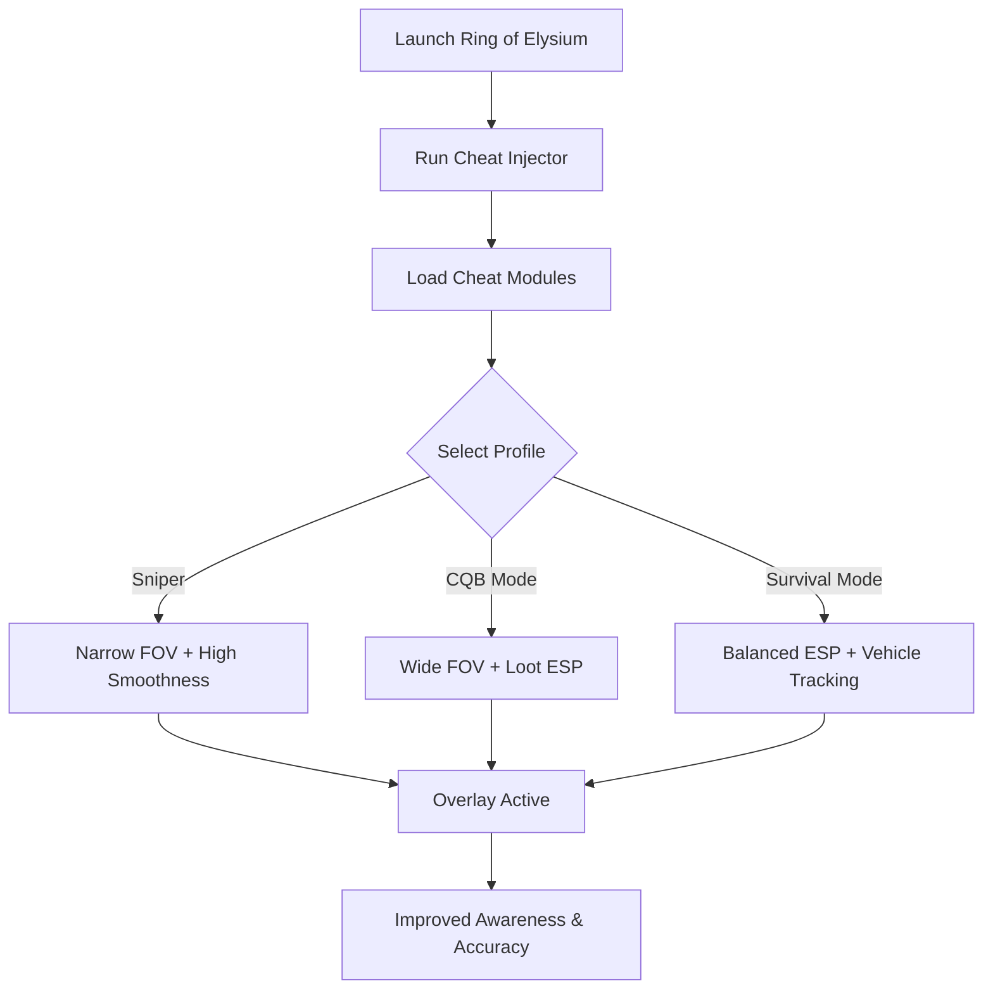

# Ring of Elysium Cheats ❄️

**Ring of Elysium (ROE)** pushes survival to the limit with dynamic weather, steep terrain, and sudden firefights. Victory requires sharp reflexes and constant awareness—but you don’t have to do it alone. The **Ring of Elysium Cheats** package provides **ESP vision, precision aim assist, and loot overlays**, giving you the advantage in every snowy showdown.

---

## 🌐 Overview

Built for **Windows PC players**, these cheats are **modular and customizable**. Toggle ESP to track enemies, highlight loot, or lock onto enemies with adjustable aim assist. With hotkey-swappable profiles, you can shift from stealth survival to full combat dominance instantly.

---

## 🔑 Features

* 👁 **ESP Overlay** – Spot enemies, allies, loot, and vehicles through terrain.
* 🎯 **Configurable Aim Assist** – Adjustable FOV, smoothness, and bone targeting.
* 💎 **Loot ESP** – Highlight rare weapons, armor, and supplies.
* 🚁 **Vehicle ESP** – Track snowmobiles, cable cars, and trucks.
* ⚡ **Recoil Manager** – Stabilizes weapon kick for tighter accuracy.
* 🗂 **Profile Manager** – Save configs for sniping, close quarters, or survival runs.
* ⌨️ **Hotkey Switching** – Instantly toggle features mid-game.
* 🔒 **Stealth Injection** – Lightweight loader with minimized detection risk.

---

[](#)
[](#)
[](#)
[](#)

---

## 🖥 Compatibility

| Platform       | Status        | Notes                         |
| -------------- | ------------- | ----------------------------- |
| Windows 10     | ✅ Supported   | Stable overlay builds         |
| Windows 11     | ✅ Optimized   | Smoothest ESP rendering       |
| Linux (Proton) | ⚠️ Partial    | ESP works, aim assist limited |
| macOS          | ❌ Unsupported | VM-only workaround            |

\[!NOTE]
The cheats are **best used on Windows builds** with DirectX rendering.

---

## ⚙️ Setup Guide

1. Download the Ring of Elysium Cheats package.

2. Extract into a secure directory.

3. Launch Ring of Elysium.

4. Run the injector as administrator:

   ```bash
   roe_cheats.exe -game roe.exe -mode stealth
   ```

5. Configure `config.ini`:

   ```ini
   [AimAssist]
   FOV=95
   Smoothness=6
   Target=Chest
   Hotkey=Mouse5

   [ESP]
   Enemies=True
   Allies=True
   Loot=True
   Vehicles=True
   EnemyColor=Red
   AllyColor=Blue
   LootColor=Yellow
   VehicleColor=Green
   ```

6. Use `Insert` to toggle overlay in-game.

\[!IMPORTANT]
Inject **after game launch** to prevent failed module hooks.

---

## 📊 Cheat Workflow



---

## 🎚 Example Configurations

**Sniper Build:**

```ini
FOV=40
Smoothness=9
Target=Head
ESP=True
```

**Close Quarters Build:**

```ini
FOV=110
Smoothness=5
Target=Chest
Loot=True
```

**Survival Build:**

```ini
Enemies=True
Loot=True
Vehicles=True
Allies=True
```

\[!WARNING]
Using too many ESP layers can clutter the screen—focus profiles are recommended.

---

## ❓ FAQ

**Q: Will the cheats hurt FPS?**
A: No, they’re optimized to run under 3% performance impact.

**Q: Can I swap configs mid-game?**
A: Yes, hotkeys let you switch instantly.

**Q: Is controller play supported?**
A: Limited—optimized for mouse/keyboard.

**Q: Do cheats update with patches?**
A: Yes, updates track Ring of Elysium patches.

**Q: Is stealth injection completely safe?**
A: It lowers detection risk, but no cheat is 100% undetectable.

---

## 🚀 Final Thoughts

The **Ring of Elysium Cheats** package blends **ESP overlays, aim assist, and loot tracking** into one powerful toolkit. Whether you’re hunting enemies, farming rare loot, or navigating snowstorms, this tool ensures unmatched awareness and precision.

[](#)
[](#)
[](#)

